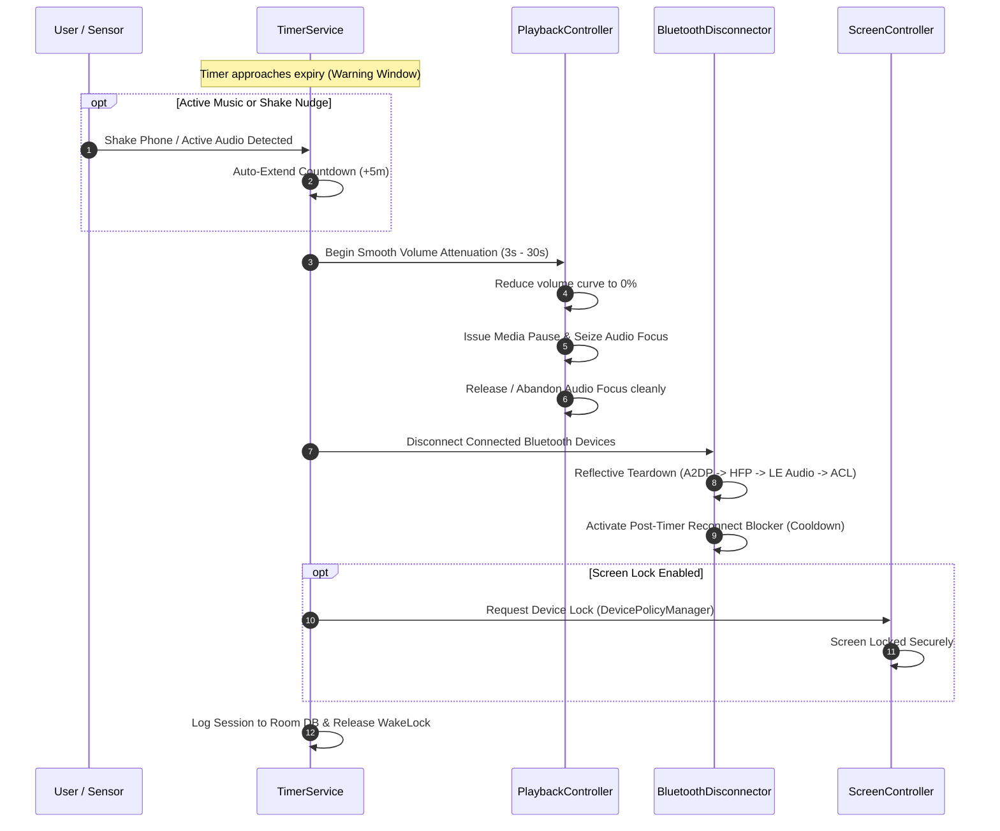

# 🌙 SleepBT — Smart Bluetooth Sleep Timer & Ear Health Protector

<p align="center">
  
</p>

<p align="center">
  <b>An offline-first, privacy-focused Android sleep timer and ear health utility engineered to gracefully fade audio, tear down Bluetooth connections, and secure your device while you fall asleep.</b>
</p>

<p align="center">
  <a href="https://github.com/anushkumar701/BTSleep/releases/latest"></a>
  <a href="https://developer.android.com/about/versions/15"></a>
  <a href="https://kotlinlang.org"></a>
  <a href="https://developer.android.com/jetpack/compose"></a>
  <a href="LICENSE"></a>
</p>

---

## 📖 Overview

Falling asleep while listening to audiobooks, podcasts, white noise, or music is a daily routine for millions. However, traditional media timers suffer from major pain points:
- **Hearing Fatigue & Ear Damage**: Continuous all-night playback directly into the ear canal causes strain according to World Health Organization (WHO) safety standards.
- **Abrupt Silence**: Instant audio cuts can trigger an arousal response, waking you just as you doze off.
- **Battery Drain & Ghost Reconnections**: Wireless earbuds often aggressively reconnect in their case or stay active, draining phone and earbud batteries.
- **Speaker Leaks**: When Bluetooth earbuds run out of power mid-sleep, phones frequently route audio to loud external phone speakers.

**SleepBT** solves this by orchestrating a resilient, ordered sleep expiry sequence. It gently attenuates playback volume, pauses media players, performs reflective Bluetooth teardown across all active profiles, and optionally locks your device screen.

---

## ✨ Key Features

### 🎛️ Precision Rotary Dial & Timer Controls
- **Tactile Rotary Input**: Set timers effortlessly from 1 to 120 minutes with a responsive circular dial and haptic feedback ticks.
- **Quick Preset Chips**: Jump straight to popular intervals (15m, 30m, 45m, 60m) with a single tap.
- **Clean Cancellation vs Expiry**: Dedicated "Cancel" cleanly aborts the countdown without touching your volume or Bluetooth, while "End Now" instantly runs the graceful shutdown sequence.

### 🔊 Smooth Volume Attenuation & Media Pause
- **Exponential Fade-Out**: Custom 3s to 30s smooth volume fade avoids abrupt transitions.
- **Universal Media Player Support**: Issues universal media playback pauses (`ACTION_AUDIO_BECOMING_NOISY`, MediaSession focus controls) compatible with Spotify, YouTube Music, Apple Music, Audible, Pocket Casts, and more.
- **Clean Audio Focus**: Seamlessly abandons transient audio focus to prevent audio hijack.

### 🎧 Multi-Protocol Reflective Bluetooth Disconnection
- **Profile Teardown**: Systematically decouples devices across **A2DP** (Media Audio), **HFP/HSP** (Call Audio), **LE Audio**, and **ACL** link layers.
- **Post-Timer Reconnection Blocker**: Enforces an active post-disconnect cooldown window (up to 120s) to prevent earbuds from immediately reconnecting if bumped.
- **Wired & Bluetooth Support**: Tracks usage and timer control across Bluetooth earbuds, headphones, speakers, and wired (3.5mm & USB-C) headsets.

### 🛡️ Real-World Sleep Enhancements
- **Active Audio Auto-Extend**: Detects if you are still actively listening when the timer expires and automatically extends countdown by configured minutes.
- **Lock Screen & Notification Controls**: Pause, Resume, Extend (+5m), End Now, or Cancel directly from the rich ongoing notification without unlocking your phone.
- **Shake-to-Extend (Nudge Detection)**: Accelerometer-powered motion detection during the warning period allows extending the timer with a sleepy nudge.
- **Quick Settings Tile**: Start or stop your favorite timer preset directly from the Android Quick Settings shade with a single tap.
- **Automatic Screen Lock**: Securely locks your phone screen via the Android Device Admin API (`DevicePolicyManager.lockNow()`).

### 📊 Ear Health Monitoring & Usage Analytics
- **WHO Hearing Safety Gauge**: Visual arc indicator categorizing your daily earbud usage into **Safe**, **Moderate**, or **High Risk** zones based on WHO daily exposure recommendations.
- **Local SQLite History**: Stores past sleep sessions and weekly trends in a private Room database with zero cloud telemetry.

---

## 🔄 Sleep Expiry Sequence



---

## 🏗️ Architecture & Tech Stack

SleepBT is built following modern Android Architecture Components and clean code best practices:

```
com.smartbluetoothsleeptracker
 ├── SleepBTApp.kt                 # Application class & DI / singletons
 ├── core
 │    ├── bluetooth                # Reflective disconnector & profile monitors
 │    ├── playback                 # Media volume attenuation & focus managers
 │    ├── haptics                  # Tactile feedback engine
 │    ├── screen                   # Device Admin screen lock controller
 │    ├── sensor                   # Shake-to-Extend accelerometer detector
 │    └── update                   # In-app GitHub release update checker
 ├── data
 │    ├── db                       # Room database, DAOs, & entities
 │    └── prefs                    # Jetpack DataStore preferences
 ├── service
 │    ├── TimerService.kt          # Foreground timer service with partial WakeLock
 │    └── SleepBTTileService.kt    # Android Quick Settings shade tile
 ├── ui
 │    ├── screens                  # Compose screens (Home, Usage, Health, Settings, Legal)
 │    └── theme                    # OLED Dark Theme ("Midnight Pulse")
 └── viewmodel                     # StateFlow-driven MVVM viewmodels
```

- **Architecture Pattern**: MVVM (Model-View-ViewModel) with Unidirectional Data Flow (UDF).
- **Asynchronous Execution**: Kotlin Coroutines, `StateFlow`, and `SharedFlow`.
- **UI Engine**: 100% Declarative Jetpack Compose using Material 3 design tokens.
- **Persistence**: Jetpack Room SQLite (`sleepbt.db`) & Jetpack Preferences DataStore (`sleepbt_prefs`).
- **Foreground Reliability**: Foreground Service with `FOREGROUND_SERVICE_MEDIA_PLAYBACK` permission and partial CPU wake-lock to resist aggressive OEM battery killers.

---

## 🔒 Privacy & Permissions Transparency

SleepBT is **100% offline-first**. No analytics, no advertising SDKs, and no tracking libraries are bundled.

| Permission | Purpose |
|---|---|
| `BLUETOOTH_CONNECT` | Query connected audio devices and perform profile disconnection. |
| `FOREGROUND_SERVICE` | Ensure timer accurately counts down without being killed in sleep mode. |
| `POST_NOTIFICATIONS` | Display remaining time, lock screen controls, and warning alerts. |
| `WAKE_LOCK` | Prevent CPU from deep-sleeping during the final seconds of countdown. |
| `VIBRATE` | Deliver tactile haptic ticks during dial rotation and button actions. |
| `DEVICE_ADMIN` *(Optional)* | Used exclusively for `DevicePolicyManager.lockNow()` to lock screen on expiry. |

---

## 📥 Download & Installation

### Option 1: Direct APK Download (Recommended)
Download the latest signed production APK from the [Releases Page](https://github.com/anushkumar701/BTSleep/releases/latest):
- **File**: `SleepBT-v1.0.2.apk`
- **Requires**: Android 11.0 (API level 30) or higher.
- **Supported ABIs**: `arm64-v8a`, `armeabi-v7a` (universal modern Android compatibility).

### Option 2: Build From Source

#### Prerequisites
- JDK 17+
- Android SDK 35 (Android 15)
- Android Studio Ladybug / Meerkat (or Gradle CLI)

```bash
# 1. Clone the repository
git clone https://github.com/anushkumar701/BTSleep.git
cd BTSleep

# 2. Run unit tests
./gradlew testDebugUnitTest

# 3. Build Debug APK
./gradlew assembleDebug

# 4. Build Signed Release APK
./gradlew assembleRelease
```

The generated APKs will be located at:
- **Release APK**: `app/build/outputs/apk/release/app-release.apk`
- **Debug APK**: `app/build/outputs/apk/debug/app-debug.apk`

---

## 🤝 Contributing

Contributions, bug reports, and feature requests are welcome!
1. Fork the Project
2. Create your Feature Branch (`git checkout -b feature/AmazingFeature`)
3. Commit your Changes (`git commit -m 'Add some AmazingFeature'`)
4. Push to the Branch (`git push origin feature/AmazingFeature`)
5. Open a Pull Request

---

## 📬 Contact & Support

Developed with care by **Midnight Compiler**.
- **Support & Inquiries**: [midnightcompiler01@gmail.com](mailto:midnightcompiler01@gmail.com)
- **Developer Profile**: [@anushkumar701](https://github.com/anushkumar701)

---

## 📄 License

Distributed under the MIT License. See [`LICENSE`](LICENSE) for more information.
